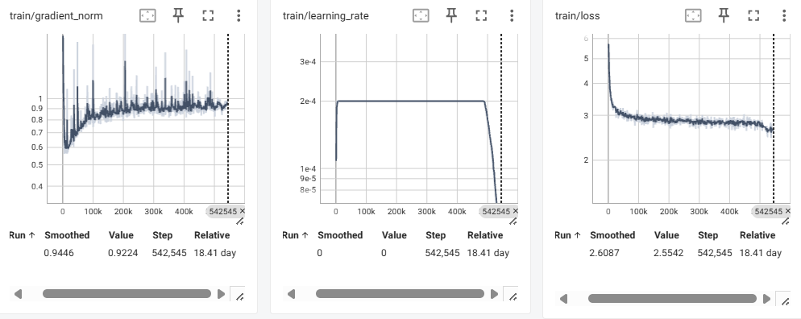
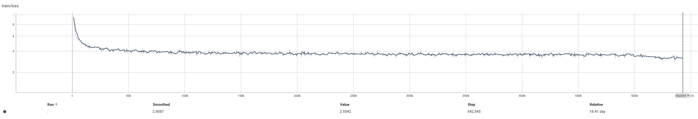
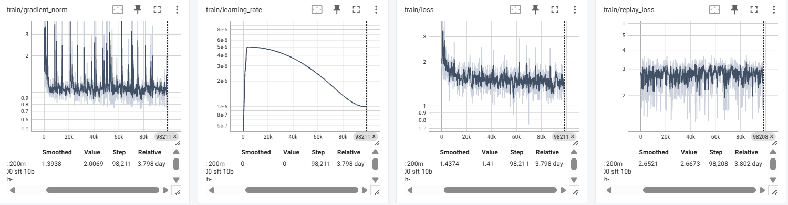

# AtomLLM

AtomLLM：从公开语料、Tokenizer 和 Decoder-only Transformer 开始，逐步完成预训练、指令微调、对齐、评测与推理部署。

## 项目特点

- **从零实现：** 32K Tokenizer、模型结构、数据管线和训练运行时。
- **中英双语：** 预训练目标约为 50% 英文、40% 简体中文和 10% 代码，英文能力数据中包含科学与数学内容。
- **完整训练语料：** 当前配方使用约 100B Token。

## Atom-Base-200M

| 项目 | 配置 |
| --- | --- |
| 参数量 | 201,882,624 |
| 架构 | Dense Decoder-only Transformer |
| 层数 / 隐藏维度 | 15 / 1,024 |
| Attention Heads / KV Heads | 16 / 4 |
| FFN | 2,816，SwiGLU |
| 归一化与位置编码 | RMSNorm、RoPE |
| Tokenizer | 32K BPE |
| 预训练上下文 | 4,096（100B 主预训练） |
| 当前配置上限 | 8,192 |
| 后续长上下文目标 | 40,960 |
| 训练精度 | BF16 |

## 权重

预训练权重已发布至[Ollama：lizhenisu/atom-base](https://ollama.com/lizhenisu/atom-base)。

## 训练

Atom-Base-200M 使用单机 3×RTX 3090 DDP 训练。4K 主预训练每步处理184,320 Token，总计 542,545 个优化器 Step；学习率采用线性 Warmup、恒定平台和末段线性 Cooldown。

## 项目进度

- [x] 实现 201,882,624 参数的 Dense Decoder-only Transformer
- [x] 支持 GQA、RoPE、RMSNorm、SwiGLU、BF16 和 40,960 长度配置
- [x] 完成英文、简体中文和代码 32K BPE Tokenizer 训练与质量评测
- [x] 完成约 100B Token 公开语料制备、去重、分片和完整性校验
- [x] 完成单卡与单机多卡 DDP、梯度累积和精确断点恢复
- [x] 完成 Safetensors Checkpoint、结构化日志和 TensorBoard 监控
- [ ] 完成 Atom-Base-200M 的 4K、100B Token 从零主预训练（进行中）
- [ ] 完成独立基座模型评测
- [ ] 完成 20K/40K 连续长文档训练与原生 40,960 上下文评测
- [ ] 完成 SFT 指令微调，训练并评测 Atom-Chat-200M
- [ ] 完成 INT8 和 INT4 模型导出与质量评测
- [x] 完成 Base/Chat 权重、Tokenizer、模型卡、HF/Ollama 格式发布工具链
- [ ] 完成本地推理与基础使用文档
- [ ] 发布 Atom-Base-200M、Atom-Chat-200M 权重、Tokenizer 和模型资料
- [ ] 按需使用偏好回答对进行 DPO 通用对话偏好对齐
- [ ] 使用高质量、可验证的推理数据进行推理能力冷启动
- [ ] 构建数学答案校验、代码测试等可验证奖励
- [ ] 使用 GRPO 增强数学、代码和多步推理能力
- [ ] 发布独立的推理增强模型权重与评测报告


## 快速开始

项目使用 Python 3.14、[uv](https://docs.astral.sh/uv/) 和 PyTorch。

```bash
uv sync --locked

# 校验正式模型配置并输出精确参数量
uv run atomllm-count-model-parameters \
  --config configs/model/atom-base-300m.yaml

# 运行测试
uv run pytest
```


## 仓库结构

```text
src/atomllm/
├── data/           # 数据获取、过滤、去重与版本管理
├── tokenizer/      # Tokenizer 训练、评测与审计
├── model/          # Transformer 模型与配置
├── training/       # 单卡/DDP 训练、Checkpoint 与监控
├── post_training/  # SFT 与后训练数据流程
└── inference/      # 本地推理入口

configs/            # 数据、模型与训练配方
tests/              # 单元测试
doc/                # 技术文档与评测报告
```

## 技术报告

- [Atom Tokenizer 32K 技术评测](doc/tokenizer/evaluations/atom-tokenizer-32k-v1.md)：测试数据、32K/48K 对照、压缩率、正确性、鲁棒性探针。

## 路线图

- 完成 Atom-Base-200M 的 100B Token 预训练与独立评测
- 完成 20K/40K 连续长文档训练与原生 40,960 上下文评测
- 训练并评测 Atom-Chat-200M
- 先发布不包含思维链与强化学习的基座、指令模型权重及模型资料
- 在首版权重发布后独立推进偏好优化、推理冷启动与 GRPO
- 探索量化与推理服务
- 在验证稳定基线后研究 MoE、MLA 和蒸馏


## 数据

Atom-Base-200M 的预训练语料全部来自公开数据集，目标规模为 1000 亿Token，其中英文 500 亿、简体中文 400 亿、代码 100 亿。数据覆盖高质量通用文本、百科、科学论文、数学网页和多语言代码。

| 数据集 | 主要内容 | 目标 Token | 仓库 |
| --- | --- | ---: | --- |
| CCI3-HQ | 高质量简体中文通用文本 | 245 亿 | [BAAI/CCI3-HQ](https://huggingface.co/datasets/BAAI/CCI3-HQ) |
| IndustryCorpus2 | 高质量简体中文行业与通用文本 | 150 亿 | [BAAI/IndustryCorpus2](https://huggingface.co/datasets/BAAI/IndustryCorpus2) |
| Wikipedia | 中英文百科文本 | 中文 5 亿、英文 40 亿 | [wikimedia/wikipedia](https://huggingface.co/datasets/wikimedia/wikipedia) |
| FineWeb-Edu | 教育质量筛选的英文网页 | 约 263.66 亿 | [HuggingFaceFW/fineweb-edu](https://huggingface.co/datasets/HuggingFaceFW/fineweb-edu) |
| OpenWebMath | 英文数学网页与公式文本 | 80 亿 | [open-web-math/open-web-math](https://huggingface.co/datasets/open-web-math/open-web-math) |
| peS2o v3 | 英文科学论文全文 | 80 亿 | [allenai/peS2o](https://huggingface.co/datasets/allenai/peS2o) |
| DCLM Baseline | 高质量英文通用文本补充 | 约 36.34 亿 | [mlfoundations/dclm-baseline-1.0-parquet](https://huggingface.co/datasets/mlfoundations/dclm-baseline-1.0-parquet) |
| StarCoderData | Python、JavaScript、Java、C/C++、Rust、Go 等代码 | 100 亿 | [bigcode/starcoderdata](https://huggingface.co/datasets/bigcode/starcoderdata) |

CCI3-HQ、IndustryCorpus2 和 FineWeb-Edu 还应用了各来源提供的高质量评分阈值。代码语料覆盖 Python、JavaScript、Java、C++、C、TypeScript、Go、Rust、Shell、SQL、HTML 和 CSS。


## 训练指标

### 预训练





### SFT


